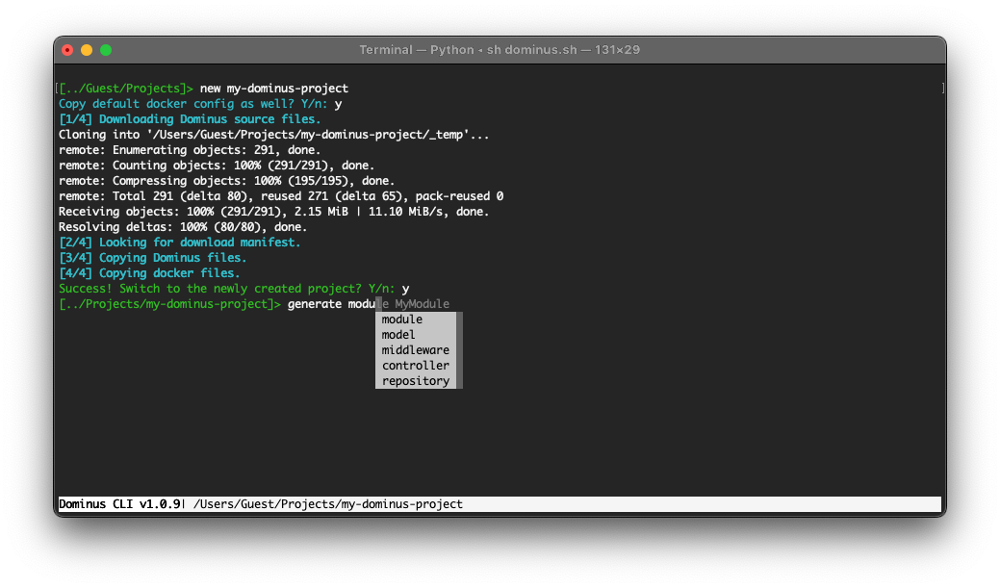

# Getting started

## Installation

You can quickly create a Dominus api backends with the [Dominus CLI](https://github.com/daniel1919-00/DominusCli). Before continuing, please make sure you have `python` and `pip` module installed on your machine, the CLI depends on them to function :).

Start by cloning the CLI files from the main repository.
``` shell
git clone https://github.com/daniel1919-00/DominusCli
```

Access the CLI using the starter scripts: `dominus.sh` for Linux/macOS or `dominus.bat` for Windows.

You may create a new project by changing the current directory to the desired path and using the `new` command.
``` shell
new my-project
```


After the project has been created, you can access it either by installing a web server yourself, or using the docker configuration (if prompted yes when asked by the cli) from the Dominus framework which includes `nginx` with `php8.1` and `xdebug` installed.

[You are now ready to create your first modules.](the%20basics/modules.md)

# Directory Structure

- Root Directory
    - [Logs](#Logs)
    - [Middleware](#Middleware)
    - [Modules](#Modules)
        - [Controllers](the%20basics/controllers.md)
        - [Models](the%20basics/models.md)
        - [Middleware](the%20basics/middleware.md)
        - [Repositories](the%20basics/repositories.md)
        - [Services](the%20basics/services.md)
    - [Services](#Services)
    - [System](#System)

## <a name="Logs"></a>Logs
Framework logs as well as php logs are stored here as .csv files with the current date (Y-m-d) as the filename.

## <a name="Middleware"></a>Middleware
Application middleware created with the CLI will be stored here.

## <a name="Modules"></a>Modules
Your modules will be stored inside this directory.

## <a name="Services"></a>Services
Framework services as well as those created with the CLI will be stored in this directory.

## <a name="System"></a>System
Framework system files are stored here and should not be modified.