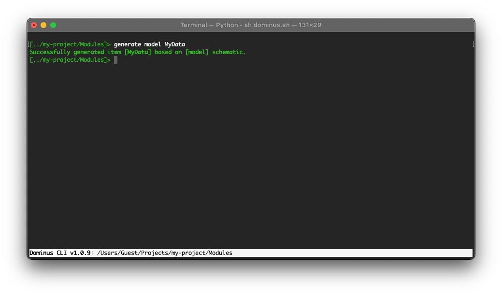

# Data models

You can create models using the Dominus CLI using the `generate model` command. It will automatically use the namespace of the current Module and create an empty class.



``` php
<?php
namespace App\Modules\MyModule\Models;

use Dominus\System\Attributes\Optional;

class MyDataModel
{
    public int $prop1 = 0;
    public string $prop2 = '';
    
    #[Optional]
    public string $optionalProp = '';
}
```

## Model attributes

### Optional
Used to mark model properties as optional, when handling requests using data models.

The framework will try and find each property name in the Request object, and will throw an Exception if the property is not found and not marked as optional.

### InitModel
Used to declare any method inside a model to be used for initialization.

This method will be called immediately after the Request object data has been mapped to the model properties.

``` php
<?php
namespace App\Modules\MyModule\Models;

use Dominus\System\Attributes\Optional;
use Dominus\System\Attributes\InitModel;

#[InitModel('init')]
class MyDataModel
{
    public int $prop1 = 0;
    public string $prop2 = '';
    
    #[Optional]
    public string $optionalProp = '';
    
    public function init()
    {
        // this method will be called immediately after the properties have been 
        // mapped from the Request object
    }
}
```


## See also

[Handling Requests](request.md)