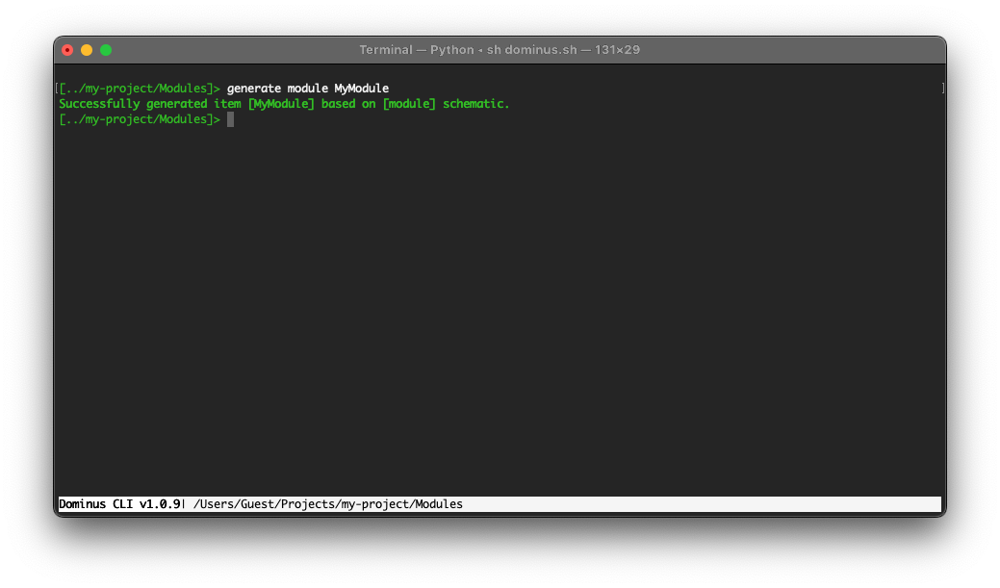

# Modules

Dominus applications are modular, these modules are containers for Controllers, Models, and everything else related to a particular module.

Modules reside in the `App/Modules` directory of a dominus project. 

You can generate modules with the command `generate module MyModule`

## See also

[Controllers](controllers.md)