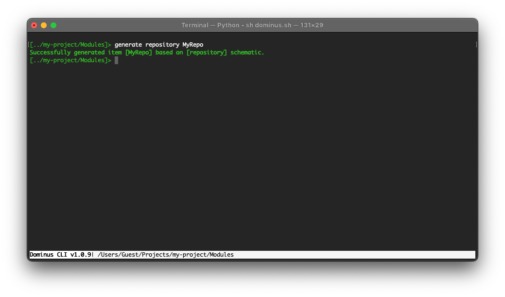

# Repository pattern

The repository pattern is intended to create an abstraction layer between the data access layer and the business logic layer of an application.

It is a data access pattern that prompts a more loosely coupled approach to data access. We create the data access logic in a separate class, or set of classes, called a repository with the responsibility of persisting the application's business model.

You can generate repository classes using the Dominus CLI with the following command: `generate repository MyRepository`



``` php
<?php
namespace Dominus\Modules\MyModule\Repositories;
use Dominus\System\Repository;

final class MyRepositoryRepository extends Repository
{
    // Example method
    // public function getItems(): array
    // {
    //    $db = $this->getDb();
    //    return $db->prepare('SELECT item_name FROM items')->execute()->fetchAllFromColumn();
    // }
}
```

## See also

[Dependency Injection](dependency%20injection.md)