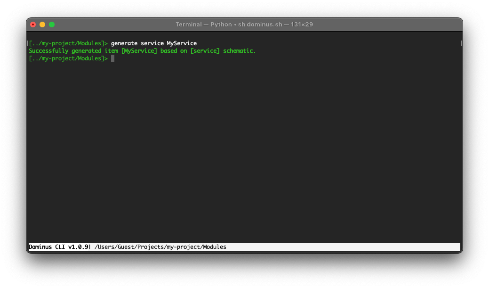

# Services

A service in Dominus is really any class that implements the `Dominus\System\Interfaces\Injectable\Injectable` interface. 

These `Injectable` classes can then be constructed and injected in any Controller constructor or method that requires it. They can also be injected into other services as well.




``` php
<?php
namespace Dominus\Services;

use Dominus\System\Interfaces\Injectable\Injectable;

class MyServiceService implements Injectable
{
    public function __construct()
    {
        
    }
}
```

## See also

[Dependency Injection](dependency%20injection.md)
[Middleware](middleware.md)