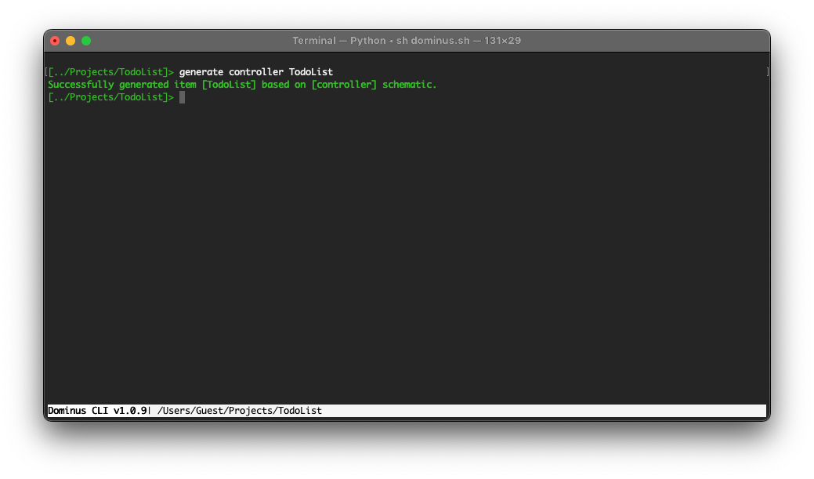

# Controllers

Controllers group related request handling logic into a single class. For example a `TodoController` class might handle all requests related to a todo list. 

Controllers are always stored in a module's `Controllers` directory.

## Basic Controllers

A controller is a class that extends the Dominus `System\Controller` base class.
Let's take a look at a simple controller which we will generate using the Dominus CLI and use it to handle requests for a todo list application.


``` php
<?php
namespace Modules\TodoList\Controllers;

use System\Controller;
use System\Attributes\Entrypoint;
use System\Attributes\RequestMethod;

#[Entrypoint('list')]
class TodoListController extends Controller
{
    #[RequestMethod('GET')]
    public function list()
    {
        return [
            'item 1',
            'item 2',
            'item 3'
        ];
    }
}
```

## Controller attributes
There are several php attributes that we can use to enhance out controllers and methods.

### Entrypoint
> System\Attributes\Entrypoint

This attribute configures the router to access the method specified by default if none is provided in the request.

### RequestMethod
> System\Attributes\RequestMethod

This attribute provides a convenient way to limit controller method access to a specific request method.

### Middleware
> System\Attributes\Middleware

Middleware may be assigned to the controller class as a whole or on specific methods