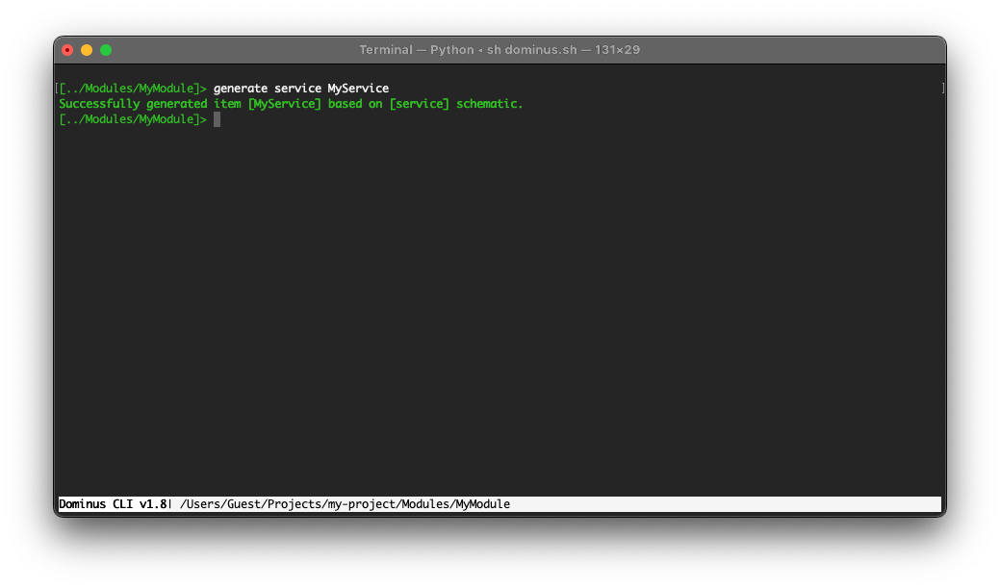

# Services

A service in Dominus is really any class that extends the `Dominus\System\Injectable` class. 

These `Injectable` classes can then be constructed and injected in any Controller constructor or method that requires it. They can also be injected into other services as well.



``` php
<?php
namespace Dominus\Services;

use Dominus\System\Injectable;

class MyServiceService extends Injectable
{
    /**
     * Use this method if this service needs special instantiation. Ex: being instantiated from a static method like DateTime::createFromFormat()
     * Note that dependency injection is not possible via this method
     * @return object the class instance to be injected
     */
    // public static function _getInjectionInstance()
    // {
    // }

    public function __construct()
    {
        
    }
}
```
