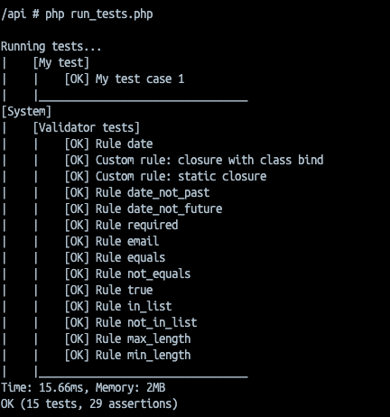

# Unit testing

Dominus comes with its own little testing framework, which can be used to run simple unit tests.

> You can generate tests easily using the [dominus cli](https://github.com/daniel1919-00/DominusCli) with the command `generate test MyTest`.

To create a unit test we begin by creating a new Test suite class in the `DominusProjectRoot/Tests` directory directly, or you can also create any number of subdirectories if you want to group your test suites further and the framework will scan for them recursively.

> Make sure your filename is the same as your class name!

Our test suite class must extend the `Dominus\System\Tests\DominusTest` base class.

``` php
<?php
use Dominus\System\Tests\DominusTest;

class MyTest extends DominusTest
{
}
```

We will use the `Dominus\System\Attributes\TestDescription` attribute to name our test suite something accordingly.

``` php
<?php
use Dominus\System\Tests\DominusTest;

#[TestDescription('My test description')]
class MyTest extends DominusTest
{
}
```

Now, we can create our individual test cases.

We can set a description to our test cases using the same `Dominus\System\Attributes\TestDescription` attribute that we used to describe our test suite.

``` php
<?php
use Dominus\System\Tests\DominusTest;
use Dominus\System\Attributes\TestDescription;
use Dominus\System\Attributes\TestRequestParameters;
use Dominus\System\Exceptions\TestFailedAssertionException;
use Dominus\System\Request;

#[TestDescription('My test description')]
class MyTest extends DominusTest
{
    /**
     * @throws TestFailedAssertionException
     */
     #[TestRequestParameters([
        'myParameter' => 'value', // parameters set here will be used to populate the Request object
    ])]
    #[TestDescription('My test case 1')]
    public function test_case_1(
        Request $request
    )
    {
        $this->assert($request->get('myParameter') === 'value');
    }
}
```

Finally, we need to `return the test instance` so that the test framework can use it;

``` php
<?php
use Dominus\System\Tests\DominusTest;
use Dominus\System\Attributes\TestDescription;
use Dominus\System\Attributes\TestRequestParameters;
use Dominus\System\Exceptions\TestFailedAssertionException;
use Dominus\System\Request;

#[TestDescription('My test description')]
class MyTest extends DominusTest
{
    /**
     * @throws TestFailedAssertionException
     */
     #[TestRequestParameters([
        'myParameter' => 'value', // parameters set here will be used to populate the Request object
    ])]
    #[TestDescription('My test case 1')]
    public function test_case_1(
        Request $request
    )
    {
        $this->assert($request->get('myParameter') === 'value');
    }
}

return new MyTest();
```

Now all that remains is to actually run our tests, to do this you can execute the `run_tests.php` file in the Dominus project root.

