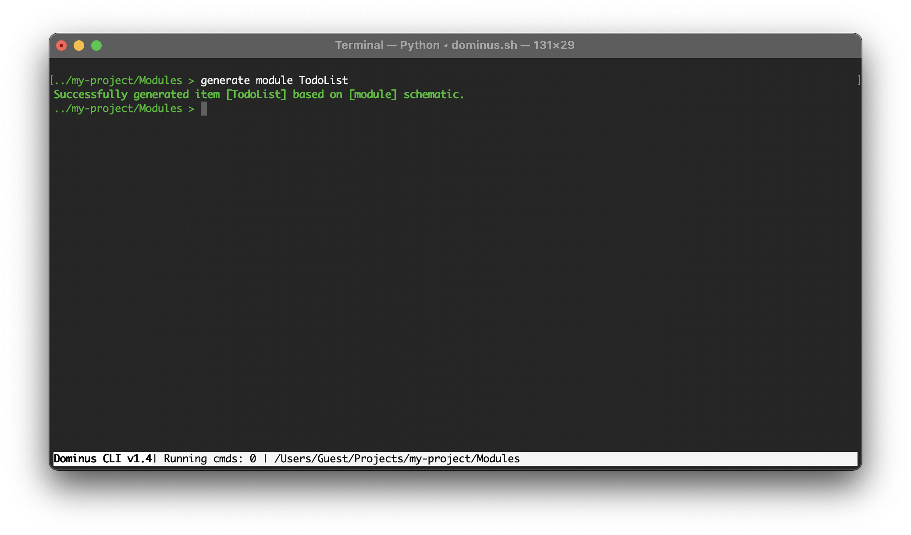

# Modules

Dominus applications are modular, these modules are containers for all Controllers, Models, and everything else related to a particular module.

You can generate modules with the command `generate module MyModule`
